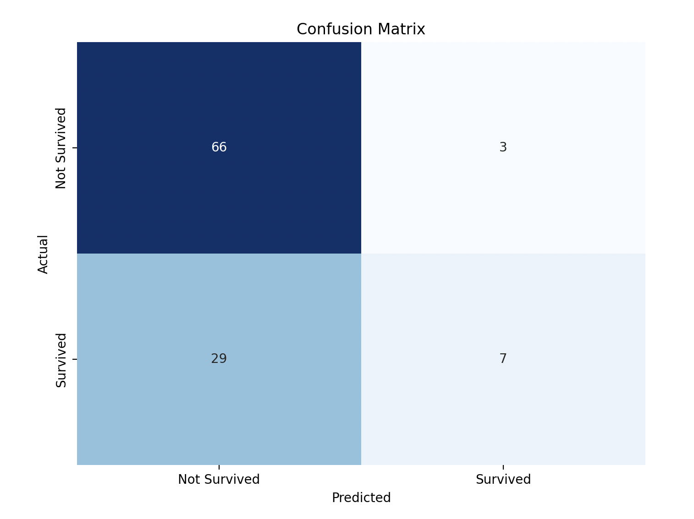

# **Titanic KNN — Mini Project**

Simple K-Nearest Neighbors classifier for the Titanic survival problem.

It loads a CSV, does light feature engineering, scales features, tunes KNN with **GridSearchCV**, and plots a confusion matrix.

> *Replace the image above with your own screenshot (e.g., **docs/screenshot.png**).*

---

## **Overview**

* **Model:** KNeighborsClassifier
* **Tuning:** GridSearchCV** over **n\_neighbors**, **metric**, **weights
* **Preprocessing (current script):**
  * **Drop: **PassengerId**, **Name**, **Ticket**, **Cabin**, **Embarked
  * Impute **Age** by median **within**Pclass
  * Impute **Fare** by global median
  * Encode **Sex** as 0/1 (but **excluded from X** in this dataset to avoid trivial leakage)
  * **Feature engineering: **FamilySize = SibSp + Parch**, **IsAlone**, **FareBin**, **AgeBin
  * Scale numeric features with **MinMaxScaler**
* **Evaluation:** Accuracy + confusion matrix

---

## **Data**

Place a CSV named **titanic.csv** in the project root.

**Important:** If you are using Kaggle’s **test.csv** merged with **gender\_submission.csv**, then **Survived** equals **(Sex == female)**. To avoid a trivial solution, the script **drops Sex from features**.

For a realistic experiment, use Kaggle’s **train.csv** (891 rows) with true labels and keep **Sex** as a feature inside a proper pipeline.

---

## **Requirements**

```
python -m venv .venv
source .venv/bin/activate       # Windows: .venv\Scripts\activate
pip install -U pip
pip install pandas numpy scikit-learn matplotlib seaborn
```

---

## **Run**

```
python3 main.py
```

---

## **Example Output**

Below is an example run on the provided **titanic.csv** (your numbers may vary slightly):

```
RangeIndex: 418 entries, 0 to 417
Data columns (total 12 columns):
 #   Column       Non-Null Count  Dtype  
---  ------       --------------  -----  
 0   PassengerId  418 non-null    int64  
 1   Survived     418 non-null    int64  
 2   Pclass       418 non-null    int64  
 3   Name         418 non-null    object 
 4   Sex          418 non-null    object 
 5   Age          332 non-null    float64
 6   SibSp        418 non-null    int64  
 7   Parch        418 non-null    int64  
 8   Ticket       418 non-null    object 
 9   Fare         417 non-null    float64
 10  Cabin        91 non-null     object 
 11  Embarked     418 non-null    object 
dtypes: float64(2), int64(5), object(5)
memory usage: 39.3+ KB
Fitting 5 folds for each of 160 candidates, totalling 800 fits
Best Model Accuracy: 69.52%
Confusion Matrix:
[[66  3]
 [29  7]]
```

> If you **keep Sex in features** on a dataset where **Survived == (Sex == female)**, you may see misleading **\~100% accuracy**. That’s label leakage, not real skill.
>
> 

---

## **License**

MIT
